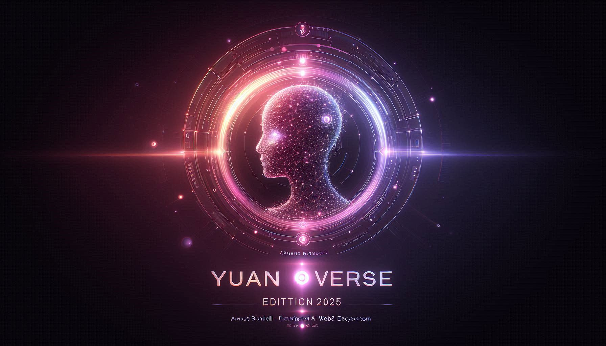

  

<h1 align="center">🪙 Yuanverse v2 — Decentralized AI & Web3 Ecosystem</h1>
<h3 align="center"><i>The next evolution of Yuancoin</i></h3>

---

### 📘 Présentation / Overview

**🇫🇷**  
Yuanverse v2 marque l’évolution de **Yuancoin (YCC)** vers un écosystème Web3 moderne, interconnecté et communautaire.  
Ce projet vise à offrir un wallet unifié (Desktop / Mobile / Web), un système de récompenses dynamique, et une infrastructure blockchain sécurisée et évolutive.  

**🇬🇧**  
**Yuanverse v2** represents the evolution of **Yuancoin (YCC)** into a modern, interconnected, and community-driven Web3 ecosystem.  
The project includes a unified wallet (Desktop / Mobile / Web), a dynamic reward system, and a secure, scalable blockchain foundation.  

---

### 📄 Télécharger le Whitepaper / Download the Whitepaper

  

---

### ⚙️ Fonctionnalités principales / Key Features

| 🇫🇷 | 🇬🇧 |
|-----|-----|
| 💎 **Wallet multi-plateforme** (Desktop, Mobile, Web) | 💎 **Multi-platform wallet** (Desktop, Mobile, Web) |
| 🎯 **Système de récompenses** basé sur les activités et le staking | 🎯 **Reward system** based on activity and staking |
| 🧩 **Smart Contracts EVM** : Staking, NFT, Référencement, Récompenses | 🧩 **EVM Smart Contracts**: Staking, NFT, Referral, Rewards |
| 🔐 **Sécurité avancée** (2FA, seed, cryptage local) | 🔐 **Advanced security** (2FA, seed, local encryption) |
| 🌍 **Architecture décentralisée** et transparente | 🌍 **Decentralized and transparent architecture** |

---

### 🪙 Tokenomics

| Catégorie | Pourcentage | Détail |
|------------|-------------|--------|
| 🔧 Développement & Infrastructure | 30 % | Financement du développement et maintenance technique |
| 🎁 Récompenses & Staking | 25 % | Distribution pour utilisateurs actifs et investisseurs fidèles |
| 💼 Partenariats & Marketing | 20 % | Croissance de l’écosystème Yuanverse |
| 🛡️ Réserve stratégique | 15 % | Sécurité et stabilisation du marché |
| 👥 Communauté & DAO | 10 % | Gouvernance et décisions communautaires |

---

### 🗓️ Feuille de route / Roadmap 2025–2026

| Période | Étapes clés |
|----------|-------------|
| **T1 2025** | Migration du réseau Yuancoin vers architecture EVM |
| **T2 2025** | Développement du wallet multi-plateforme |
| **T3 2025** | Lancement du système de récompenses (missions, parrainage) |
| **T4 2025** | Publication du Mainnet Yuanverse v2 |
| **2026** | Extension internationale + intégration DAO et NFT Marketplace |

---

### 🔗 Ressources / Resources

- 💾 **Code source officiel** : [Yuancoin GitHub](https://github.com/yuancoins/Yuancoin-Source)  
- 🪙 **Token** : YCC  
- 👤 **Auteur / Author** : Arnaud Biondelli – Founder & Lead Developer of Yuanverse  
- 🌐 **Site web (à venir)** : [yuanverse.io](https://yuanverse.io)  

---

  <i>“De l’artisanat à la chaîne — un monde façonné par la création, l’intelligence et la liberté.”</i> 
  <i>“From craftsmanship to the blockchain — a world shaped by creation, intelligence, and freedom.”</i>

---

  <b>© 2025 Yuanverse v2 – Arnaud Biondelli</b>

