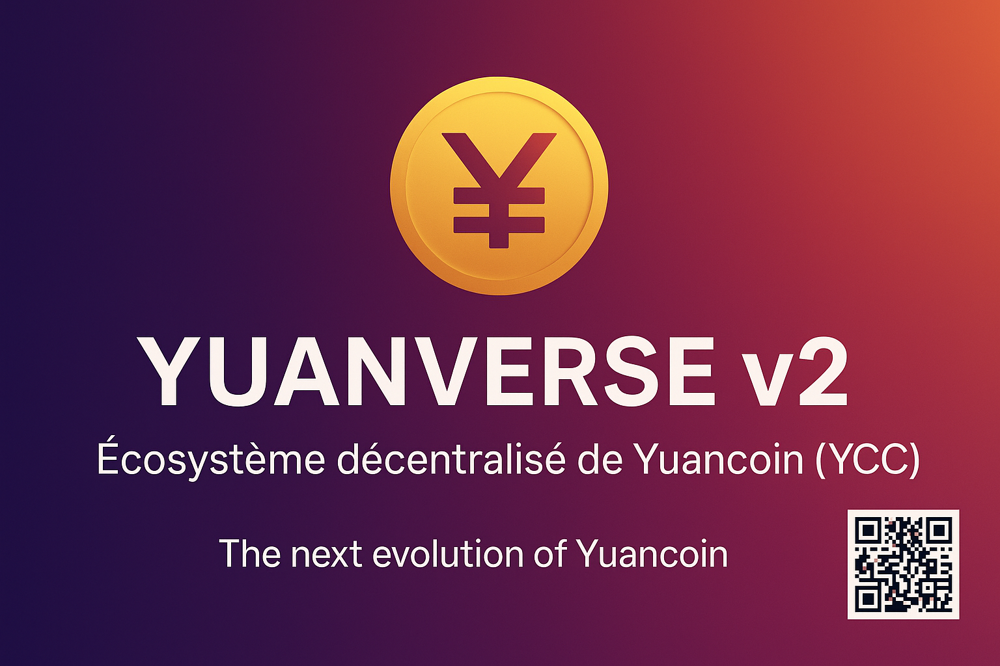

  

<h1 align="center">🪙 Yuanverse v2.1 – Économie décentralisée au service des artisans français</h1>
<h3 align="center"><i>From workshop to blockchain</i></h3>

---

### 📘 Présentation / Overview

**🇫🇷**  
Yuanverse v2.1 marque une nouvelle étape pour **Yuancoin (YCC)** : la création d’un écosystème Web3 dédié aux **artisans français**.  
Le projet vise à simplifier les paiements, les échanges et l’achat de matériel tout en valorisant la production locale et le savoir-faire français.  
Grâce à la blockchain, les transactions deviennent rapides, équitables et sans intermédiaires.  

**🇬🇧**  
**Yuanverse v2.1** represents a new chapter for **Yuancoin (YCC)** — building a Web3 ecosystem designed to **empower French artisans**.  
It simplifies payments, trade, and equipment purchasing while promoting local craftsmanship and transparency.  
Blockchain technology enables instant, fair, and decentralized transactions between artisans and clients.  

---

### 📄 Télécharger le Whitepaper / Download the Whitepaper

  

---

### ⚙️ Fonctionnalités principales / Key Features

| 🇫🇷 | 🇬🇧 |
|-----|-----|
| 💼 **Wallet des artisans** : paiements rapides, simples et sans frais bancaires | 💼 **Artisan Wallet**: fast, simple, and fee-free payments |
| 🛠️ **Marketplace artisanale** : acheter/vendre des créations 100% françaises | 🛠️ **Artisan Marketplace**: buy/sell French-made products directly |
| 🎯 **Système de récompenses** : cashback, missions et fidélité | 🎯 **Reward system**: cashback, missions, and loyalty |
| 🧩 **Smart Contracts EVM** : Paiement, Staking, NFT, Référencement | 🧩 **EVM Smart Contracts**: Payment, Staking, NFT, Referral |
| 🔐 **Sécurité avancée** : 2FA, clé seed, chiffrement local | 🔐 **Advanced Security**: 2FA, seed phrase, local encryption |
| 🌍 **Gouvernance décentralisée (DAO)** | 🌍 **Decentralized governance (DAO)** |

---

### 🪙 Tokenomics (mise à jour 2025)

| Catégorie | Pourcentage | Détail |
|------------|-------------|--------|
| 👷 Récompenses artisans & acheteurs | 35 % | Cashback, fidélité et missions communautaires |
| 🔧 Développement & Maintenance | 25 % | Évolution du wallet et de la marketplace |
| 🤝 Partenariats & Communication | 15 % | Coopératives, chambres, événements artisanaux |
| 🏛️ Fonds communautaire (DAO) | 15 % | Projets votés par les artisans |
| 🛡️ Réserve stratégique | 10 % | Sécurité et liquidité du token |

---

### 🗓️ Feuille de route / Roadmap 2025–2026

| Période | Étapes clés |
|----------|-------------|
| **T4 2025** | Mise à jour du wallet YCC pour artisans |
| **T1 2026** | Lancement de la marketplace artisanale (bêta) |
| **T2 2026** | Déploiement du système de récompenses et DAO |
| **T3 2026** | Partenariats avec fournisseurs français |
| **T4 2026** | Expansion européenne et interopérabilité blockchain |

---

### 🔗 Ressources / Resources

- 💾 **Code source officiel** : [Yuancoin GitHub](https://github.com/yuancoins/Yuancoin-Source)  
- 🪙 **Token** : YCC  
- 👤 **Auteur / Author** : Arnaud Biondelli – Founder & Lead Developer of Yuanverse  
- 🌐 **Hébergement** : GitHub (open-source, décentralisé)  

---

  <i>“De l’atelier au blockchain — un monde façonné par la création, l’intelligence et la liberté.”</i> 
  <i>“From workshop to blockchain — a world shaped by creation, intelligence, and freedom.”</i>

---

  © 2025 <b>Yuanverse</b> – All Rights Reserved  

  © 2025 <b>Yuanverse</b> – All Rights Reserved  

